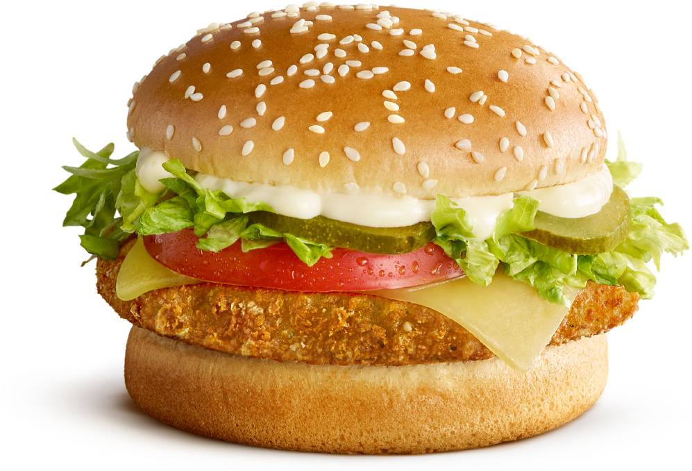
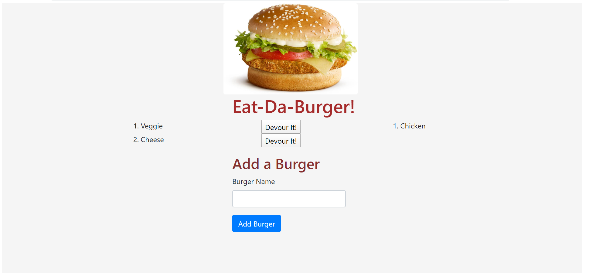

# Eat-Da-Burger

Table of Contents:

[Description](#Description:)

[Installation](#Installation:)

[HerokuURL](#HerokuURL:)

[SCHEMASQL](#SchemaSQL:)

[SEEDSSQL](#SeedsSQL:)

[Usage](#Usage:)

[Licence](#Licence:)

[Contributing](#Contributing:)

[Screenshots](#Screenshots:)

[References](#References:)

# Description:

Eat-Da-Burger! is a restaurant app that lets users input the names of burgers they'd like to eat. Whenever a user submits a burger's name, app will display the burger on the left side of the page -- waiting to be devoured. Each burger in the waiting area also has a `Devour it!` button. When the user clicks it, the burger will move to the right side of the page. App will store every burger in a database, whether devoured or not.

# Installation:

Navigate to following folder

https://github.com/atulsd/burger

Clone the Repo

To view the web pages go to the following link

https://atulsd.github.io/burger/

# HerokuURL:

https://serene-shore-30708.herokuapp.com/

# SchemaSQL

https://github.com/atulsd/burger/blob/master/db/schema.sql

# SeedsSQL

https://github.com/atulsd/burger/blob/master/db/seeds.sql

# Contributing

This is an open source project and is avaiable for anyone with a reference to it.

# Usage

Eat-Da-Burger! is a restaurant app that lets users input the names of burgers they'd like to eat.

# Licence

# Screenshots

# References:

https://getbootstrap.com/docs/4.4/layout/grid/#auto-layout-columns
